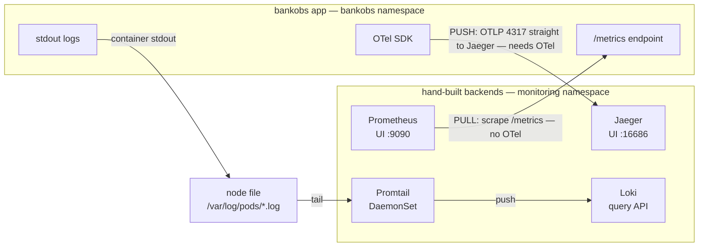

# Observability by hand — the three pillars without OpenTelemetry

## Why this lab exists

In the main course, bankobs ships **everything** through OpenTelemetry: metrics, logs and
traces all leave each service as OTLP, hit an **OpenTelemetry Collector**, and the Collector
fans them out to Prometheus, Loki and Jaeger. It's clean — and because it's clean, it hides
what each backend actually does. You never see Prometheus *pull*, you never write a Promtail
config, you never point an app at a tracing backend. OTel does it all.

This lab removes OTel from the middle and makes you wire each backend **by hand**:

- **Prometheus** — you'll make it *pull* `/metrics` straight off the app pods.
- **Loki** — you'll run **Promtail** to tail the app's stdout and push it in.
- **Jaeger** — you'll point the app's traces *directly* at Jaeger, no Collector.

By the end you'll have working metrics, logs and traces built three completely different
ways. Then (docs/05) you'll see why OpenTelemetry was invented — because doing it by hand is
exactly the pain OTel removes.

## The one surprise, up front

Two of the three pillars need **nothing** from the application:

| Pillar | Does the app need to change? | Why |
|--------|------------------------------|-----|
| **Metrics** | No | The app already exposes `/metrics`. Prometheus pulls it. |
| **Logs**    | No | The app already writes to stdout. Promtail tails it. |
| **Traces**  | **Yes — and only OTel can do it** | A trace must be created *inside* the code, as the request flows. Nothing outside the process can reconstruct it. |

That asymmetry is the heart of the lab. Metrics and logs are things the app *emits* that a
tool can collect from the outside. A **trace** has to be stitched together *inside* every
service as the request passes through — which means in-process instrumentation, which means
a tracing library in every language. That is the problem OpenTelemetry was born to solve.

## The map



- **Metrics (pull):** Prometheus reaches *into* the app and scrapes `/metrics`. No OTel.
- **Logs (tail):** the app just writes stdout; Promtail tails the node's log file and pushes to Loki. No OTel.
- **Traces (push):** the app's OTel SDK sends OTLP straight to Jaeger — the one pillar that needs in-process instrumentation.

## How to use this lab

Every section exists **twice**, saying the same thing:

1. **The document** (`docs/0N-*.md`) — read it to understand *why* each step is done.
2. **The Makefile** — run it to *do* the steps, and it prints each command as it goes, in
   the same order as the doc.

So you have three ways to work, your choice:

```bash
make metrics          # run the section; watch every command scroll by
make metrics DRY=1    # PRINT every command but run nothing — then type them yourself
# ...or just read docs/02 and copy-paste the commands.
```

Sections, in order:

| # | Doc | Make target | Builds |
|---|-----|-------------|--------|
| 0 | [`cluster/`](../cluster/README.md) | `make cluster` | an empty Kubernetes cluster |
| 1 | [01-deploy-app.md](01-deploy-app.md) | `make app` | the app, with observability OFF |
| 2 | [02-metrics-prometheus.md](02-metrics-prometheus.md) | `make metrics` | Prometheus (pull) |
| 3 | [03-logs-loki.md](03-logs-loki.md) | `make logs` | Loki + Promtail |
| 4 | [04-traces-jaeger.md](04-traces-jaeger.md) | `make traces` | Jaeger (direct) |
| 5 | [05-why-opentelemetry.md](05-why-opentelemetry.md) | — | the payoff |

`make all` runs 1→4. `make verify` checks all three. `make urls` prints the UIs.
`make traffic` generates load so there's something to see. `make clean` removes the
backends.

## Prerequisites

- A Linux VM you can SSH to (Amazon Linux 2023 / Ubuntu, x86_64, ~8 vCPU / 16–32 GB for the
  full bankobs app). **Section 0 (`cluster/`) turns that VM into a Kubernetes cluster** — you
  don't need a cluster beforehand.
- A bankobs **license** in `../student-bootcamp/.env` — `make app` reuses the bootcamp's
  platform deploy, which needs it.
- `kubectl`, `helm`, `jq` (installed by `cluster/scripts/install-tools.sh`).
- Namespaces: the **app** lives in `bankobs`, the **backends** you build live in `monitoring`.

> **Section 0 makes Kubernetes; it does not create the VM itself.** You bring the VM (or ask
> for one); `cluster/` installs the tooling and stands up a single-node kind cluster on it.
